# Frontend Workflows

End-to-end journeys a Kabil.ai frontend implements, with sequence diagrams and
the state machine. Pair this with [`API_REFERENCE.md`](./API_REFERENCE.md) for
exact request/response shapes and [`ASYNC_AND_POLLING.md`](./ASYNC_AND_POLLING.md)
for the eventual-consistency rules that govern *when* data appears.

> Diagrams use Mermaid — they render on GitHub and in most Markdown viewers.

---

## The product in one paragraph

HR creates a **Job** (draft), then **opens** it — which kicks off an async job
pipeline (embed the JD + AI-generate WhatsApp screening questions) and exposes a
**public apply link**. Candidates upload a CV via that link (or HR bulk-uploads
PDFs). Each CV runs an async **CV pipeline** (extract → parse → authenticity →
embed → similarity → maybe auto-reject). HR then triages the **Applications**
list, opens an application to see the explainable scores (similarity / CV fit /
authenticity), and walks it through pipeline **stages**, rejecting/accepting
along the way. Moving an application to the **`whatsapp`** stage triggers an
automated WhatsApp screening conversation (interest check → questions) that HR
reads as a transcript. Separately, HR keeps a **Talent Pool** of strong
candidates — searchable by free text — and can **source** any of them onto a
job, which spins up a fresh, fully-scored application.

---

## 1. HR onboarding & auth

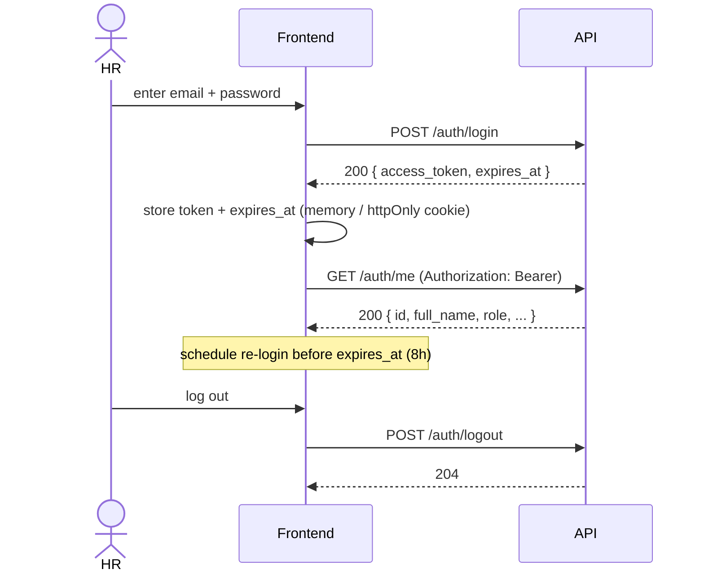

**FE notes**
- Keep the token out of `localStorage` if you can; an httpOnly cookie set by a
  Next.js route handler / middleware is safer. Either way, attach
  `Authorization: Bearer <token>` to every HR request.
- On any `401`, clear the session and route to login.
- Use `expires_at` to refresh proactively (there's no refresh-token endpoint —
  re-login).

---

## 2. Create & open a job (job pipeline)

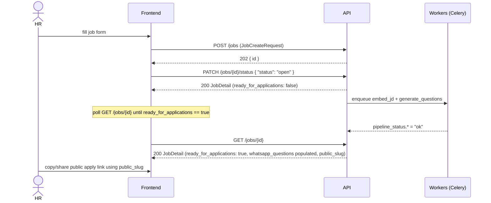

**FE notes**
- After opening, **`ready_for_applications` is `false` until both pipeline steps
  finish.** Poll `GET /jobs/{id}` (or refetch on the detail page) and gate the
  "share link" / "questions ready" UI on that flag. See
  [`ASYNC_AND_POLLING.md`](./ASYNC_AND_POLLING.md).
- The public apply URL is built from `public_slug`, e.g.
  `https://your-frontend/apply/{public_slug}` → which posts to
  `POST /public/apply/{public_slug}/upload`.
- HR can review/edit AI questions via the WhatsApp-questions endpoints before or
  after sharing.

---

## 3. Candidate applies (public, anonymous)

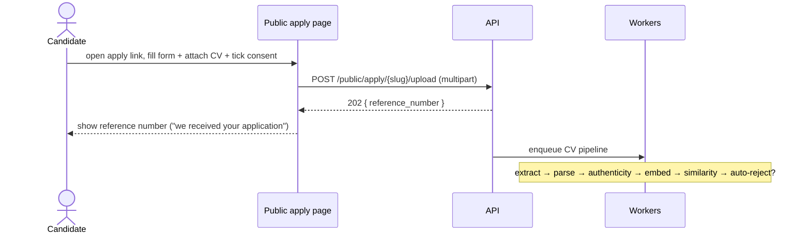

**FE notes**
- `multipart/form-data` with `pdf, email, phone, full_name, consent` and a
  hidden `honeypot` input (keep it visually hidden, not `display:none`-only if
  you want to catch more bots; leave it empty for real users).
- **Identical success response** whether new, duplicate, or honeypot — never
  tell the user "you already applied". Just show the reference number.
- Handle: `410` (link expired/invalid → "this posting is no longer open"),
  `400` (missing consent / invalid email / invalid phone → field errors).
- The candidate has no further API access; the reference number is just for
  their records.

---

## 4. HR bulk-uploads CVs

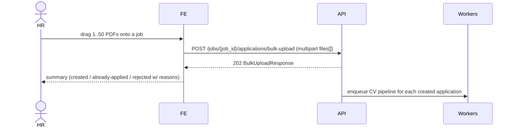

**FE notes**
- Show the three buckets from the response: `applications` (new),
  `already_applied` (link straight to the existing application), `rejected`
  (with a friendly mapping of `reason` → copy, see [`ENUMS.md`](./ENUMS.md)).
- `accepted_count` = created + already-applied. `rejected_count` = rejected.
- Whole-request `400` only when file count is 0 or >50; `422` if the job is
  closed; `401` without auth.
- Newly created applications still need their CV pipeline to run before scores
  appear — same polling story as section 5.

---

## 5. Triage: list → detail → scores

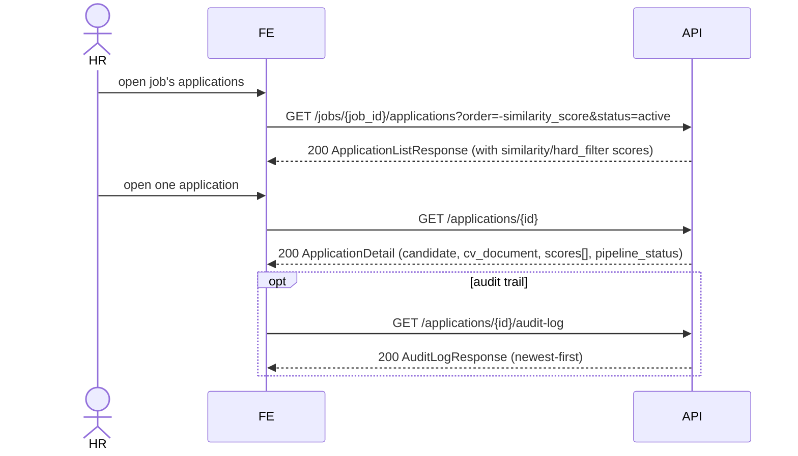

**FE notes**
- List rows carry `similarity_score` and `hard_filter_score` denormalized —
  sort/filter in the UI without opening each row. `hard_filter_score` is `null`
  until the application has been through the `hard_filter` stage. Prefer the
  server-side `order=` params for sorting; these fields are **percentage
  strings** (`"82%"`), so a client-side numeric sort must `parseFloat` first.
- Detail `scores[]` holds the explainability: one entry per score family with a
  `breakdown`. Each `value` is a percentage string (`"82%"`); inside a
  `breakdown`, `score`/`weight` leaves are too. The `authenticity` entry has
  `id: null` (it's synthesized).
- `parsed_profile` is `{}` until the parse step runs — render a skeleton/"still
  processing" state, don't assume keys exist.
- Use `rejection_reason` (detail) to explain auto-rejections.

---

## 6. Move an application through the pipeline

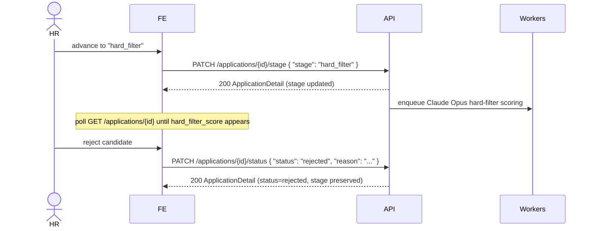

**FE notes**
- Stage transitions are **forward-only and single-step** (see state machine
  below). Don't render "skip to interview" — a 2-step jump returns `422`.
- Entering `hard_filter` triggers async CV scoring; `hard_filter_score` is
  `null` until it lands. Poll the detail endpoint.
- Status is independent of stage: rejecting preserves the stage, and
  `rejected → active` brings the candidate back at the same stage.
- Entering the `whatsapp` stage fires the screening invite — see section 8.
- `reason` (≤500 chars) is optional but recommended — it lands in the audit log.

---

## 7. Manual rescore

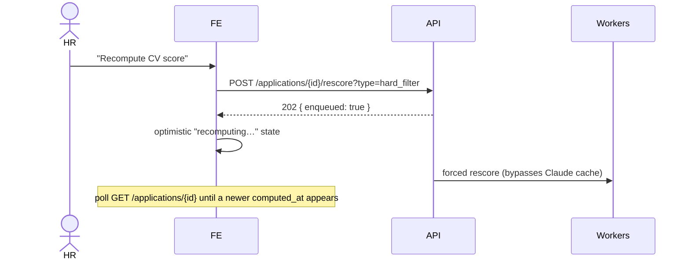

**FE notes**
- The endpoint returns `202` immediately; the score updates later. The backend
  nulls the existing score while recomputing, so the detail endpoint shows
  "in progress" until the new value lands.
- Detect completion by a newer `computed_at` on the matching `scores[]` entry
  (or `hard_filter_score`/`similarity_score` becoming non-null again).

---

## 8. WhatsApp screening (auto, on the `whatsapp` stage)

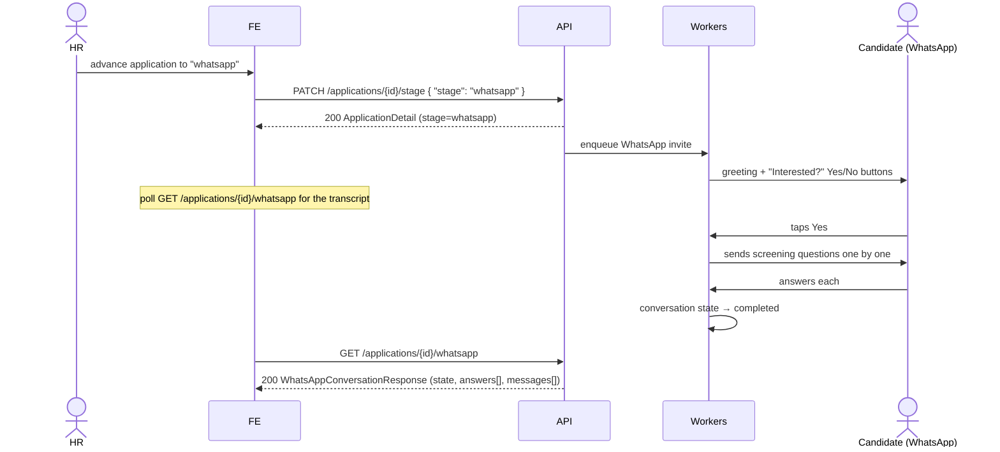

**FE notes**
- The transcript endpoint returns `404 whatsapp_conversation_not_found` until
  the invite has opened a conversation. After moving to `whatsapp`, poll until
  it returns `200`, then poll for new `messages[]` while
  `state ∈ {awaiting_interest, asking_questions}`.
- Render `messages[]` as a chat thread keyed on `direction`
  (`outbound` = us, `inbound` = candidate). `button_reply` messages are the
  candidate tapping Yes/No (`button_id` = `interest_yes`/`interest_no`).
- `state` drives the status chip: awaiting interest / answering questions /
  **completed** / **declined** (terminal). `current_question_index` +
  `answers[]` show progress.
- A candidate who taps **No** → `declined`, and the application is rejected with
  a WhatsApp decline reason (visible in the audit log).
- HR can re-open a closed conversation by reactivating a `whatsapp`-stage
  application (`PATCH …/status { "status": "active" }`) — that sends a
  "welcome back" greeting on the same conversation.

---

## 9. Talent pool: add / search / source

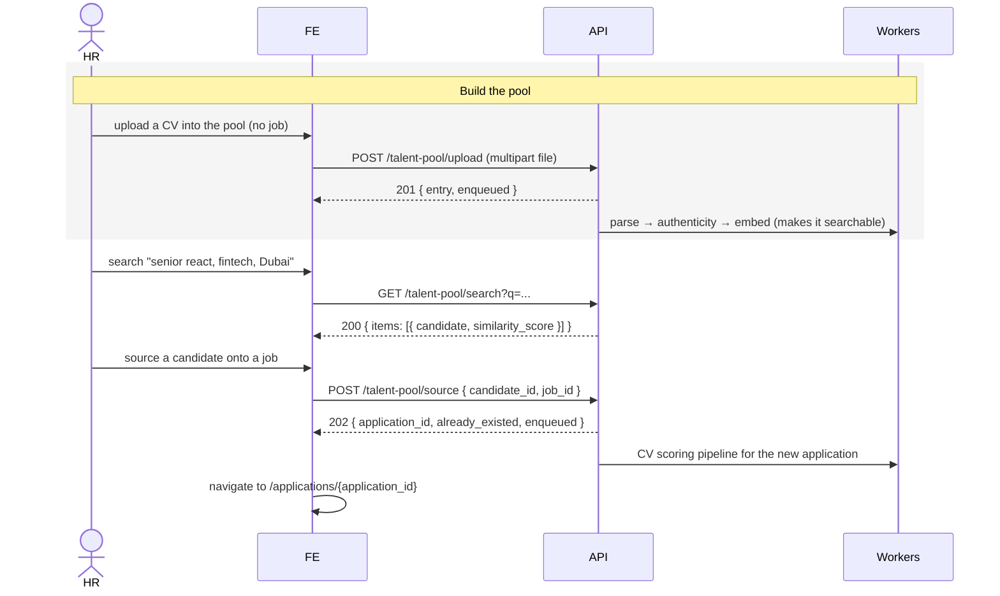

**FE notes**
- Two ways into the pool: `POST /talent-pool/entries` (an existing candidate) or
  `POST /talent-pool/upload` (a fresh CV). After an upload, `enqueued: true`
  means the candidate isn't searchable yet — the embed pipeline must finish, so
  search results lag a freshly-uploaded CV by a few seconds.
- Search `similarity_score` is **0–100** (higher = closer). Candidates without an
  embedded CV are silently excluded from results.
- **Source** creates a normal application at `vector_screen` and routes you to
  its detail page; from there it's the same triage flow as section 5/6. If
  `already_existed: true`, no new application was made — just open the returned
  `application_id`.
- Sourced candidates get a tailored WhatsApp greeting later ("we came across
  your profile…") instead of the "thanks for applying" one.

---

## Application state machine

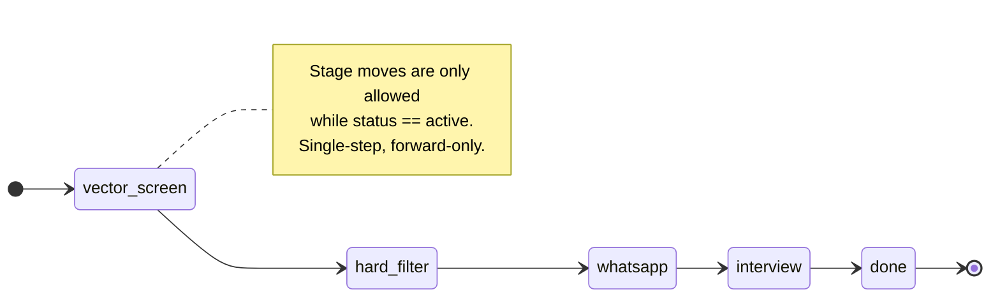

**Status (orthogonal to stage):**

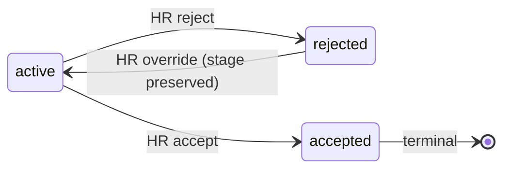

| From stage | Allowed next stage |
|---|---|
| `vector_screen` | `hard_filter` |
| `hard_filter` | `whatsapp` |
| `whatsapp` | `interview` |
| `interview` | `done` |
| `done` | _(none)_ |

| From status | Allowed next status |
|---|---|
| `active` | `rejected`, `accepted` |
| `rejected` | `active` |
| `accepted` | _(terminal)_ |

> The `whatsapp` stage is now live: entering it opens an automated screening
> conversation, readable via `GET /applications/{id}/whatsapp` (section 8). The
> `interview` stage is wired in the matrix but its feature surface (interview
> slots) lands in Phase 6 — those keys are intentionally absent from responses
> today, not empty arrays.

---

## Appendix A: minimal typed client

A small wrapper that centralizes the base URL, auth header, and error
unwrapping. Expand as needed.

```ts
// lib/kabil/client.ts
import type { ApiError } from "./types";

const BASE = process.env.NEXT_PUBLIC_KABIL_API!;

export class KabilApiError extends Error {
  constructor(public status: number, public body: ApiError) {
    super(body.message ?? body.error);
  }
}

export async function api<T>(
  path: string,
  opts: RequestInit & { token?: string } = {},
): Promise<T> {
  const { token, headers, ...rest } = opts;
  const res = await fetch(`${BASE}${path}`, {
    ...rest,
    headers: {
      ...(token ? { Authorization: `Bearer ${token}` } : {}),
      // NOTE: do NOT set Content-Type when body is FormData
      ...headers,
    },
  });
  if (res.status === 204) return undefined as T;
  const body = await res.json();
  if (!res.ok) throw new KabilApiError(res.status, body as ApiError);
  return body as T;
}

// usage:
// const jobs = await api<JobListResponse>("/jobs?status=open", { token });
```
